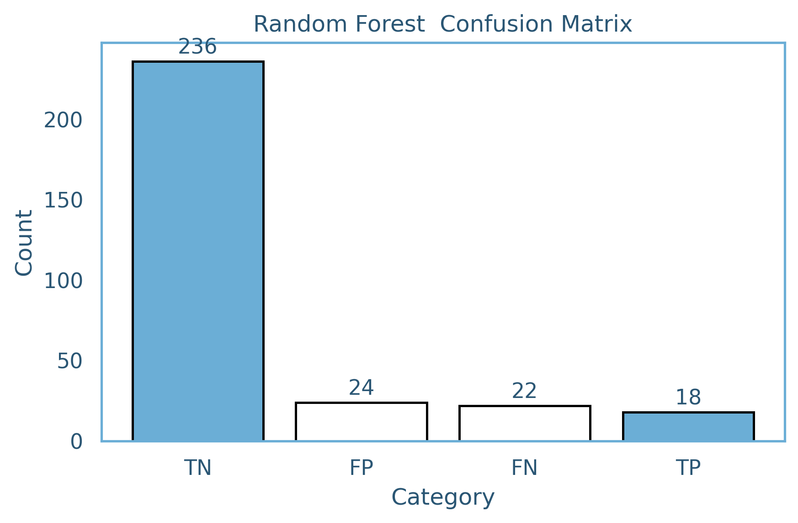
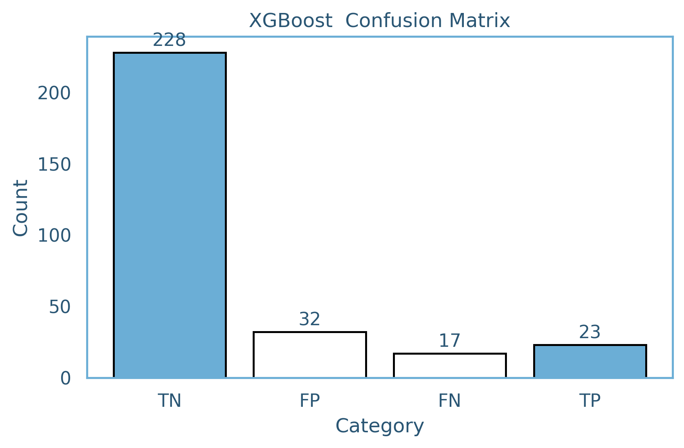
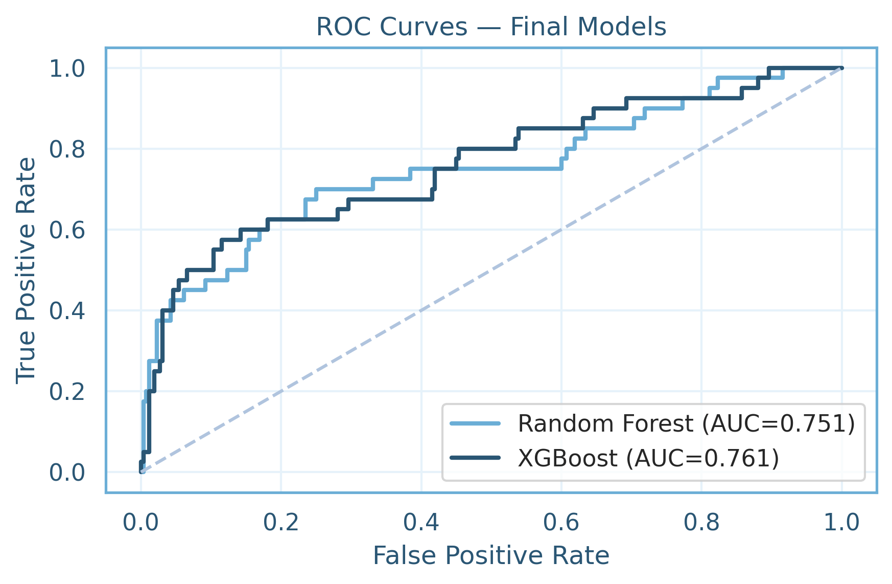
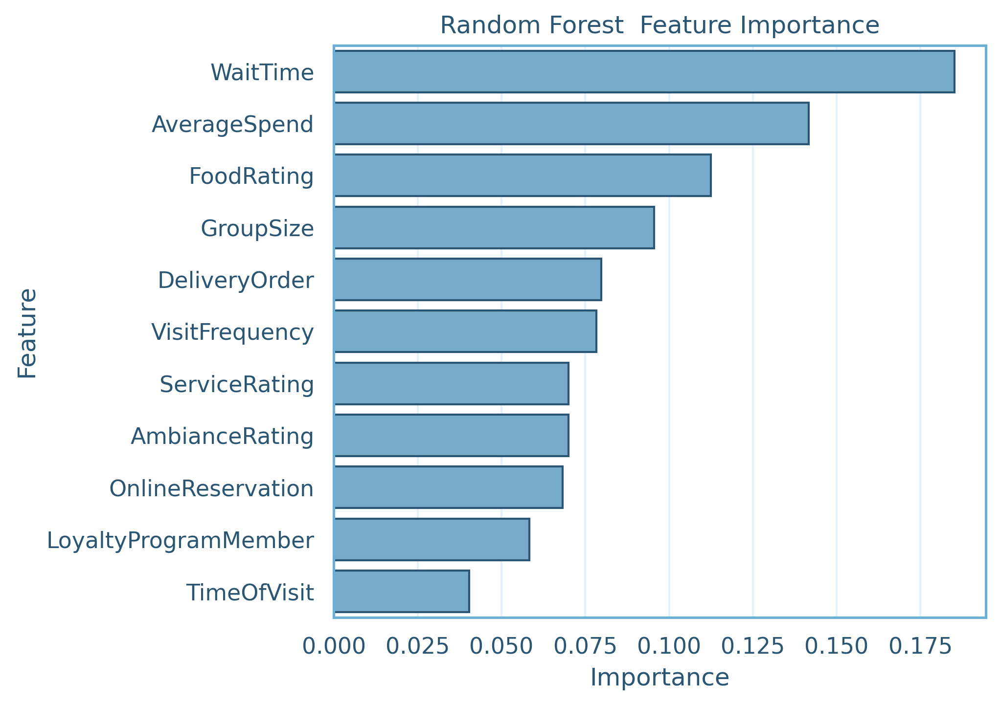
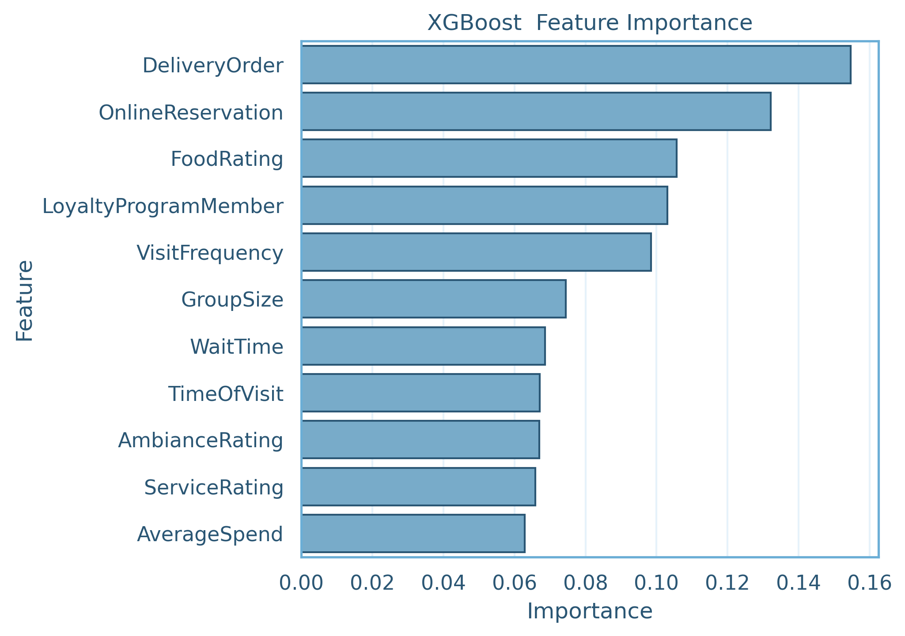

# ML Customer Satisfaction  
### Predicting Highly Satisfied Restaurant Customers Using Machine Learning  
**Author:** Maurisa Dacosta  

---

##  Overview  
This project uses machine learning to understand what drives restaurant customer satisfaction. Using a dataset of 1,500 customers, I cleaned the data, analyzed patterns, trained Random Forest and XGBoost models, handled class imbalance, performed hyperparameter tuning, and evaluated the final models on a separate test set.  

The project predicts which customers are *highly satisfied* and identifies the most important operational and experiential factors that influence satisfaction.

---

## Project Description

### Motivation  
Restaurants rely on returning customers, and satisfaction is a major factor in whether they come back. Because satisfaction is influenced by many different variables, machine learning helps identify which factors matter most.

### Aims  
- Build models that accurately predict highly satisfied customers  
- Improve minority-class detection (only 13.4% of customers are highly satisfied)  
- Identify the key factors that drive satisfaction  
- Provide actionable recommendations for restaurant management  

### Dataset  
**Source:** Kaggle  
**Size:** 1,500 rows × 19 columns  

Includes:  
- Wait time  
- Food/Service/Ambiance ratings  
- Spend amount  
- Visit frequency & time of visit  
- Delivery order & reservation usage  
- Loyalty membership  
- Target label: **HighSatisfaction**

After cleaning, the dataset was split into:  
- **train_split.csv** (used for training & tuning)  
- **test_split.csv** (held out for final evaluation)  

---

## Methods

### Data Cleaning  
- Removed irrelevant columns (CustomerID, Gender, PreferredCuisine, MealType)  
- Encoded categorical variables  
- Converted numeric columns  
- Verified no missing or duplicate values  

### Addressing Class Imbalance  
Only **13.4%** of customers were "highly satisfied."  
I used:  
- **RandomOverSampler**  
- XGBoost's internal weighting mechanism  

### Models Used  
- **Random Forest**  
- **XGBoost**

Chosen because they handle non-linear feature interactions and provide interpretable feature importance.

### Evaluation Metrics  
- Accuracy  
- Precision  
- Recall  
- F1 Score  
- AUC  
- Confusion Matrix  
- ROC Curve  

Hyperparameter tuning was performed with **RandomizedSearchCV**, and final models were retrained on the full training data.

---

## Results & Findings

### Overall Summary  
- **XGBoost** was best at detecting highly satisfied customers  
- **Random Forest** had the highest overall accuracy  
- Both models achieved **AUC ≈ 0.75**  
- Feature importance revealed a blend of operational, experiential, and behavioral drivers  

---

## Final Model Performance

### XGBoost (Best for Positive Class)
- **F1 Score:** 0.484  
- **Recall:** 0.575  
- **AUC:** 0.761  

### Random Forest (Best Overall Accuracy)
- **Accuracy:** 0.847  
- **F1 Score:** 0.439  
- **AUC:** 0.751  

---

## Model Comparison Table

| Metric | Random Forest | XGBoost |
|--------|--------------|----------|
| Accuracy | **0.847** | 0.837 |
| Precision (Positive Class) | 0.429 | 0.418 |
| Recall (Positive Class) | 0.450 | **0.575** |
| F1 Score | 0.439 | **0.484** |
| AUC | 0.751 | **0.761** |

---

## Key Figures

### Random Forest — Confusion Matrix  

### XGBoost — Confusion Matrix  

### ROC Curves  

### Random Forest Feature Importance  

### XGBoost Feature Importance  

---

## Interpretation of Findings

### What Drives Satisfaction?

#### Random Forest (Operational + Experiential)
- Shorter **wait times**  
- **Food** and **service** quality  
- Spending behavior  
- Group size differences  

#### XGBoost (Behavioral + Engagement)
- **Delivery orders**  
- **Online reservations**  
- **Loyalty program** participation  
- **Visit frequency**  

Together, these findings show satisfaction is shaped by a combination of operational efficiency, customer experience, and customer behavior.

---

## Business Recommendations

### Based on the model insights:
- Reduce **wait times** for immediate impact  
- Improve **food and service consistency**  
- Strengthen **delivery and reservation systems**  
- Enhance **loyalty programs** to support returning customers  

---

## Limitations
- Significant class imbalance  
- Missing contextual variables (location, staffing, time-based patterns)  
- Dataset may not generalize to all restaurant types  
- No text review or sentiment information  

---

## Future Work  
- Enrich dataset with more behavioral and contextual features  
- Apply models like LightGBM, CatBoost, or neural networks  
- Use cost-sensitive learning rather than oversampling  
- Add probability calibration for better interpretation  
- Build a real-time dashboard for restaurant managers  

---

## Conclusion  
Both Random Forest and XGBoost produced strong predictive insights about customer satisfaction. XGBoost gave the best performance for identifying highly satisfied customers, while Random Forest offered clear, interpretable insights into operational drivers.  

This project demonstrates how machine learning can help restaurants make informed, data-driven decisions to improve customer satisfaction.

